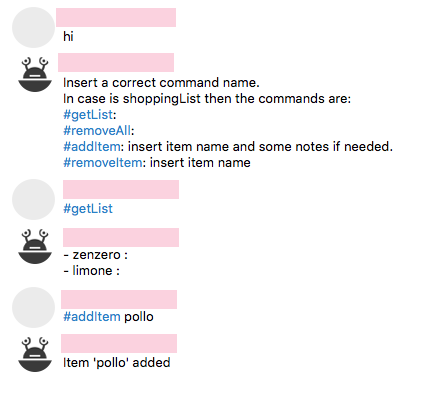

# myTeleBot
I am using telepot: builds applications for Telegram Bot API. The current version contains a main file to communicate with the bot, 
which can integrate any new module to handle different new operations. Right now the only module handled is a shopping list manager.
In order to execute the system you need to change the value of the *token* var inside *smartHome.py* with the token of your bot, and then run the python file:

```python smartHome.py```

Here we have a snapshot example of the chat with our bot:

